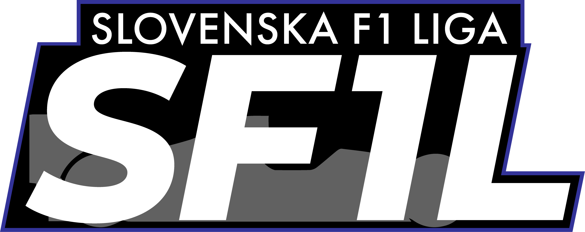

[![Contributors][contributors-shield]][contributors-url]
[![Forks][forks-shield]][forks-url]
[![Stargazers][stars-shield]][stars-url]
[![Issues][issues-shield]][issues-url]

 

  

<h3 align="center">Slovenian Formula 1 e-League</h3>

  

    Website for the Slovenian Formula 1 e-League.  
     
    <a href="https://github.com/maticjesenicnik/sf1l"><strong>Explore the docs »</strong></a>
     
     
    <a href="https://sf1l.si">View Website</a>
    ·
    <a href="https://github.com/maticjesenicnik/sf1l/issues">Report Bug</a>
    ·
    <a href="https://github.com/maticjesenicnik/sf1l/issues">Request Feature</a>
  

<!-- TABLE OF CONTENTS -->

  
Table of Contents

  <ol>
    <li>
      <a href="#about-the-project">About The Project</a>
      <ul>
        <li><a href="#built-with">Built With</a></li>
      </ul>
    </li>
    <li><a href="#roadmap">Roadmap</a></li>
    <li><a href="#contributing">Contributing</a></li>
    <li><a href="#contact">Contact</a></li>
  </ol>

<!-- ABOUT THE PROJECT -->
## About The Project

<!-- [![Product Name Screen Shot][product-screenshot]](https://sf1l.si) -->

Project for the Slovenian Formula 1 e-League's website.
Includes seasonal leaderboards, race history, sponsors, 
news, drivers of the week, registration forms and so much more.

(<a href="#top">back to top</a>)

<!-- BUILT WITH -->
### Built With

* [Nest.js](https://nestjs.com/)
* [React.js](https://reactjs.org/)
* [Svelte](https://svelte.dev/)

(<a href="#top">back to top</a>)

<!-- ROADMAP -->
## Roadmap

- [ ] Seasonal leaderboards
- [ ] Race history and results
- [ ] Hall of Fame
- [ ] League registration forms
- [ ] League news
- [ ] Stewards findings
- [ ] Driver of the week
- [ ] Video archives
- [ ] League rules
- [ ] Calendar
- [ ] Sponsors
- [ ] Drivers
- [ ] Website API

See the [open issues](https://github.com/maticjesenicnik/sf1l/issues) 
for a full list of proposed features (and known issues).

(<a href="#top">back to top</a>)

<!-- CONTRIBUTING -->
## Contributing

Contributions are what make the open source community such an 
amazing place to learn, inspire, and create. Any contributions 
you make are **greatly appreciated**.

If you have a suggestion that would make this better, please 
fork the repo and create a pull request. You can also simply 
open an issue with the tag "enhancement".

Don't forget to give the project a star! Thanks again!

1. Fork the Project
2. Create your Feature Branch (`git checkout -b feat/feature-name`)
3. Commit your Changes (`git commit -m 'feature description'`)
4. Push to the Branch (`git push origin feature/feature-name`)
5. Open a Pull Request

(<a href="#top">back to top</a>)

<!-- CONTACT -->
## Contact

Matic Jeseničnik – [@MaticJesenicnik](https://twitter.com/maticjesenicnik) - sf1l@jesenicnik.com

Project Link: [https://github.com/maticjesenicnik/sf1l](https://github.com/maticjesenicnik/sf1l)

(<a href="#top">back to top</a>)

<!-- MARKDOWN LINKS & IMAGES -->
<!-- https://www.markdownguide.org/basic-syntax/#reference-style-links -->
[contributors-shield]: https://img.shields.io/github/contributors/maticjesenicnik/sf1l.svg?style=for-the-badge
[contributors-url]: https://github.com/maticjesenicnik/sf1l/graphs/contributors
[forks-shield]: https://img.shields.io/github/forks/maticjesenicnik/sf1l.svg?style=for-the-badge
[forks-url]: https://github.com/maticjesenicnik/sf1l/network/members
[stars-shield]: https://img.shields.io/github/stars/maticjesenicnik/sf1l.svg?style=for-the-badge
[stars-url]: https://github.com/maticjesenicnik/sf1l/stargazers
[issues-shield]: https://img.shields.io/github/issues/maticjesenicnik/sf1l.svg?style=for-the-badge
[issues-url]: https://github.com/maticjesenicnik/sf1l/issues
[license-shield]: https://img.shields.io/github/license/maticjesenicnik/sf1l.svg?style=for-the-badge
[license-url]: https://github.com/maticjesenicnik/sf1l/blob/master/LICENSE.txt
<!-- [product-screenshot]: images/screenshot.png -->
